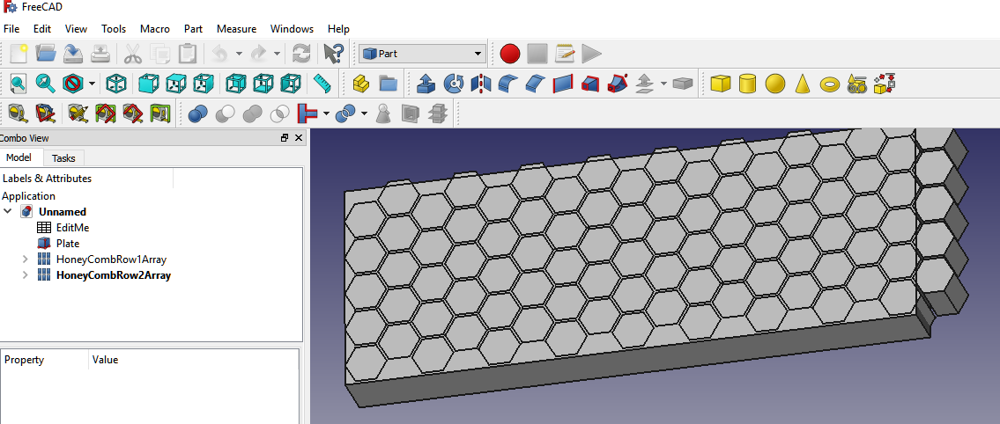
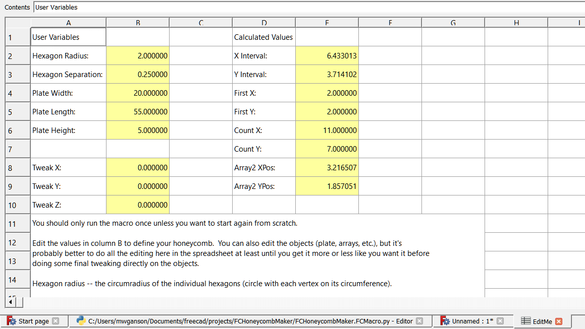
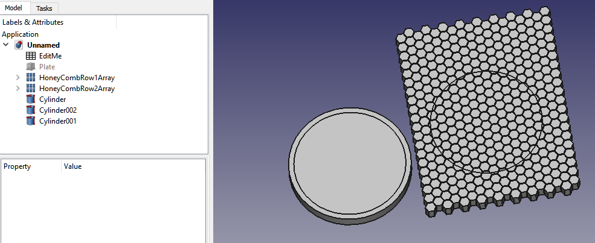
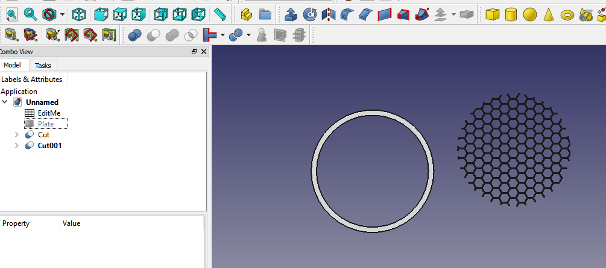
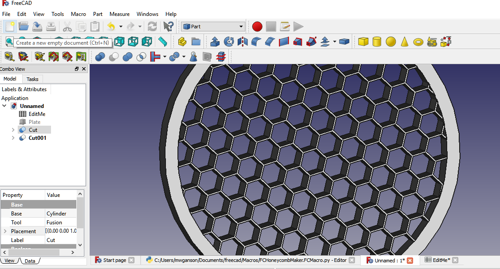
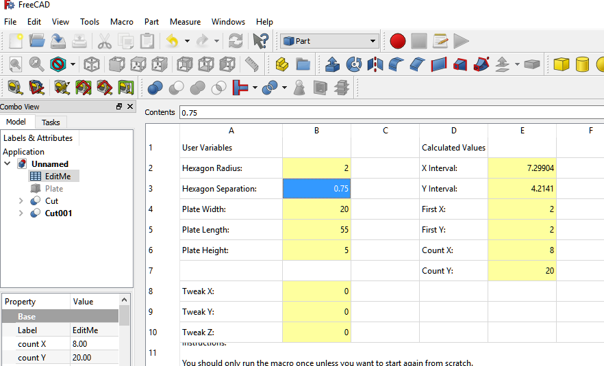
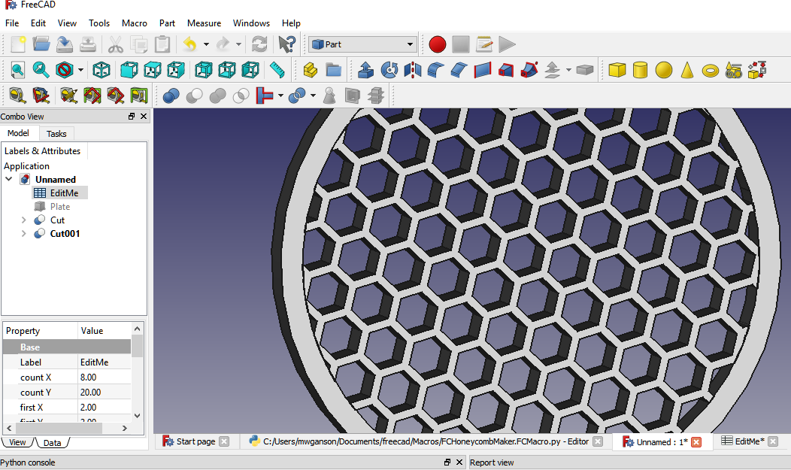
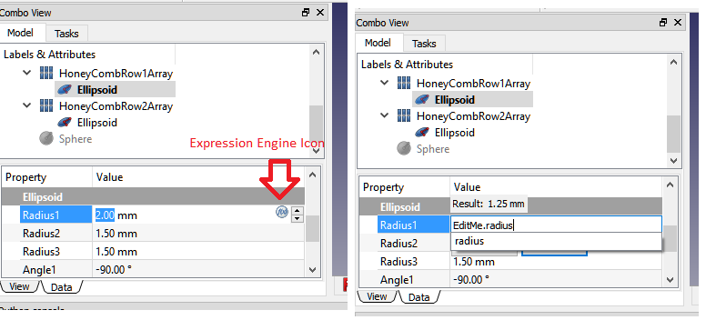

# FCHoneycombMaker
Aids in laying out rectangular array of hexagons to form a honeycomb grid.

When you execute the macro it creates a spreadsheet called "EditMe", a 6-sized regular polygon, which gets extruded into a prism, 2 rectangular areas of said hexagons, and a "plate", which is just a resized cube.

Modify the values in the spreadsheet to customize the honeycomb:

These are the same instructions found in the spreadsheet:

Instructions:

You should only run the macro once unless you want to start again from scratch.

Edit the values in column B to define your honeycomb.  You can also edit the objects (plate, arrays, etc.), but it's 
probably better to do all the editing here in the spreadsheet at least until you get it more or less like you want it before
doing some final tweaking directly on the objects.

Hexagon radius -- the circumradius of the individual hexagons (circle with each vertex on its circumference).

Hexagon separation -- distance between each hexagon, the thickness of the grid produced after cutting the hexagons from the plate.

Plate dimensions -- sets the dimensions of the plate out of which the honeycomb can be cut.  These values are used to calculate
the countX and countY variables.  You can delete the plate object if you wish to apply the hexagon arrays to a different structure.

Tweak X,Y,Z -- Edit these to move both hexagon arrays independently of the plate object, for example to center the arrays inside 
the plate.

CountX and CountY -- number of hexagons in the 2 arrays.  These are calculated based on the plate size, radius of hexagons, and 
separation between them, but you will probably want to modify these manually.  Just remember if you modify them you are replacing 
the formulas in those cells with immediate values, and thus they won't be recalulated for you if other changes are made.

If you would prefer a round plate, simply delete the plate object and replace it with a cylinder, and then use the Tweak values 
and countX and countY variables to arrange the hexagon arrays to your liking.

The final step in the process is to fuse the arrays together, and then cut them out of the plate.

If you want to create a border (or have margins) you can resize the plate independtly of the honeycomb by adjusting its properties 
in the data tab in the combo view.  To do this you'll need to click the round expression engine icon, and then choose discard, just 
bear in mind this will break the links to the spreadsheet.

In the above image I have hidden the initial rectangular plate and added 3 cylinders because I want to show how you can use this to make a circular grid, too.  I could have deleted the plate object, too.

In the above image the 2 arrays were fused together, and then cut out of the first cylinder.  Additionally, I have cut the smaller cylinder out of the larger cylinder to create a border ring, which I have then positioned into place and is ready to be fused with the other cut.

I decided my screen wasn't thick enough, so I edited the EditMe spreadsheet:

and it automatically updated the final object:

If you'd prefer a different shape as the base you could easily swap out the extruded hexagon with a sphere or, as I did in the image below, an ellipsoid shaped somewhat like an egg.  Could be used to create egg crate designs.

All you need to do to make that change is to change the Base property in the 2 arrays from extruded hexagon to the new object.  The hexagon is linked (its radius) to the spreadsheet, and the extruded hexagon is also linked (its length forward), so you might want to hook those links with the new object if you want its relevant properties updated when you change values in the spreadsheet.  Just click the expression engine icon in the property (combo view, data tab) and enter EditMe.height, EditMe.radius, or whichever value you want to link with for that property of that object.

Because we use draft array objects for the arrays, these can also be easily extended into the z direction if you want to, for example, to create a hollowed out interior.  Just set the ZNumber property in both arrays to the desired number.  You can also link the ZInterval to the spreadsheet using EditMe.xInterval or EditMe.yInterval or something like EditMe.height+EditMe.separation.

